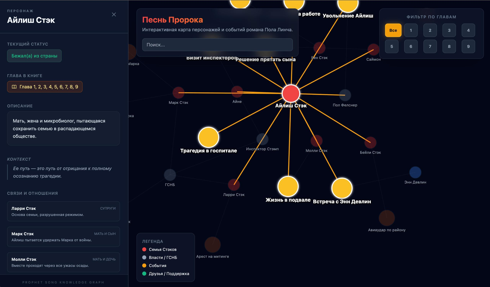

<div align="center">

</div>

# Песнь Пророка: Интерактивная карта персонажей

**[🌐 Открыть приложение](https://matperez.github.io/prophet-song-interactive-map/)**

Интерактивная визуализация графа знаний романа "Песнь Пророка" Пола Линча. Исследуйте персонажей, события и трагические связи семьи Стэков в антиутопической Ирландии через динамическую сетевую визуализацию.

## Возможности

- **Интерактивный граф знаний** — визуализация связей между персонажами, событиями и группами
- **Фильтрация по главам** — просмотр событий и персонажей по главам романа (1-9)
- **Поиск** — быстрый поиск персонажей и событий
- **Детальная информация** — боковая панель с описаниями, статусами и связями персонажей
- **Визуальная категоризация** — цветовое кодирование по группам (семья, власти, друзья, события)

## Технологии

- **React 19** — UI библиотека
- **D3.js** — визуализация графа и физическая симуляция
- **TypeScript** — типизированный JavaScript
- **Vite** — сборщик и dev-сервер
- **Tailwind CSS** — стилизация

## Запуск локально

**Требования:** Node.js

1. Установите зависимости:
   ```bash
   npm install
   ```

2. Запустите приложение:
   ```bash
   npm run dev
   ```

3. Откройте браузер по адресу `http://localhost:3000`

## Сборка для продакшена

```bash
npm run build
```

Собранные файлы будут в директории `dist/`.

## Деплой на GitHub Pages

Проект автоматически деплоится на GitHub Pages при каждом push в ветку `main` через GitHub Actions.

### Настройка (один раз)

1. Перейдите в настройки репозитория: **Settings** → **Pages**
2. В разделе **Source** выберите **GitHub Actions**
3. Workflow автоматически запустится при следующем push в `main`

### Ручной запуск деплоя

Вы можете запустить деплой вручную через вкладку **Actions** → выберите workflow **Deploy to GitHub Pages** → **Run workflow**

После успешного деплоя приложение будет доступно по адресу:
`https://matperez.github.io/prophet-song-interactive-map/`
